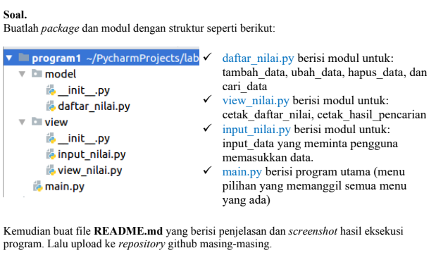

# UASsemester1

## SOAL UJIAN



## Struktur Package & Module


- Didalam folder / package model terdapat 1 file dengan nama daftar nilai. Dan didalam file tersebut telah terdapat beberapa function yang dibuat untuk menjalankan program tersebut.<br>
- Berikut adalah isi dari file **daftar_nilai.py**

```python
from view.input_nilai import *
data = {}
while True:
    header="PROGRAM INPUT NILAI MAHASISWA"
    header2=("MENU UTAMA")
    print(header.center(97,"="))
    print()
    print(header2.center(97,"_"))
    c = input("\n(T)ambah, (U)bah), (H)apus, (C)ari, (K)eluar: ")
    if c.lower() == 't':
        print("Tambah Data")
        nama = input("Nama\t\t: ")
        nim = int(input("NIM\t\t: "))
        uts = int(input("Nilai UTS\t: "))
        uas = int(input("Nilai UAS\t: "))
        tugas = int(input("Nilai Tugas\t: "))
        akhir = tugas*30/100 + uts*35/100 + uas*35/100
        data[nama] = nim, uts, uas, tugas, akhir
    elif c.lower() == 'u':
        print("Ubah Data")
        nama = input("Masukkan Nama   : ")
        if nama in data.keys():
            nim = int(input("NIM\t\t: "))
            uts = int(input("Nilai UTS\t: "))
            uas = int(input("Nilai UAS\t: "))
            tugas = int(input("Nilai Tugas\t: "))
            akhir = tugas*30/100 + uts*35/100 + uas*35/100
            data[nama] = nim, uts, uas, tugas, akhir
        else:
            print("Nama {0} tidak ditemukan".format(nama))
    elif c.lower() == 'h':
        print("Hapus Data")
        nama = input("Masukkan Nama  : ")
        if nama in data.keys():
            del data[nama]
        else:
            print("Nama {0} Tidak Ditemukan".format(nama))
    elif c.lower() == 'c':
        print("Cari Data[case-sensitive]")
        nama = input("Masukkan Nama : ")
        if nama in data.keys():
            print("="*73)
            print("|                             Daftar Mahasiswa                          |")
            print("="*73)
            print("| Nama            |       NIM       |  UTS  |  UAS  |  Tugas  |  Akhir  |")
            print("="*73)
            print("| {0:15s} | {1:15d} | {2:5d} | {3:5d} | {4:7d} | {5:7.2f} |"
                  .format(nama, nim, uts, uas, tugas, akhir))
            print("="*73)
        else:
            print("Nama {0} Tidak Ditemukan".format(nama))
    elif c. lower() == 'k':
        break
    else:
        print("Pilih menu yang tersedia")
```

- Disisi lain saya membuat folder / package view yang berisi file input_nilai.py dan view_nilai.py<br>
- Berikut adalah isi dari file **input_nilai.py** :
```python
Menginput data
list_nama = []
list_nim = []
list_uts = []
list_tugas = []
list_uas = []
rata = []
a = 0
while True:
    list_nama.append(str(input("Masukan Nama\t\t : ")))
    list_nim.append(int(input("Masukan NIM\t\t : ")))
    tugas = int(input("Masukan Nilai Tugas\t : "))
    list_tugas.append(tugas)
    uts = int(input("Masukan Nilai UTS\t : "))
    list_uts.append(uts)
    uas = int(input("Masukan Nilai UAS\t : "))
    list_uas.append(uas)
    rata.append(tugas * 30/100 + uts * 35/100 + uas * 35/100)
    n = input("Lanjut (Y/T)\t\t : ")
    if n == "t" or n == "T":
        break
print ()
print (68*"=")
print("| {0:^3} | {1:^12} | {2:^9} | {3:^5} | {4:^5} | {5:^5} | {6:^7} |".format("NO", "NAMA", "NIM" , "TUGAS", "UTS", "UAS", "AKHIR"))
print (68*"=")
no = 0
for nama, nim, tugas, uts, uas, akhir in zip (list_nama, list_nim, list_tugas, list_uts, list_uas, rata):
    no += 1
    print ("| {0:>3} | {1:<12} | {2:>9} | {3:>5} | {4:>5} | {5:>5} | {6:>7} |".format(no, nama, nim, tugas, uts, uas, akhir))
print (68*"=")
```
- Berikut adalah isi dari file **view_nilai.py** : <br>
```python
print("--------------------------------")
selected_menu = input("Pilih menu> ")
print("Ketik (L) untuk Menampilkan Data")
if selected_menu == "L":
    if x.items():
        print("=" * 74)
        print("|                            Daftar Mahasiswa                            |")
        print("=" * 74)
        print("| No |     Nama        |     NIM     |  UTS  |  UAS  |  Tugas  |  Akhir  |")
        print("=" * 74)
        i = 0
        for z in x.items():
            i += 1
            print("| {no:^2} | {0:15} | {1:^11d} | {2:^5d} | {3:^5d} | {4:^7d} | {5:^7.2f} |"
                  .format(z[0][:13], z[1][0], z[1][1], z[1][2], z[1][3], z[1][4], no=i))
        print("=" * 74)
    else:
        print("=" * 73)
        print("|                             Daftar Mahasiswa                          |")
        print("=" * 73)
        print("|         Nama         |    NIM    |  UTS  |  UAS  |  Tugas  |   Akhir  |")
        print("=" * 73)
        print("|                             TIDAK ADA DATA                            |")
        print("=" * 73)
    print()
```
- Setelah membuat banyak folder / package dan function, saya membuat file index atau file utamanya. Yang saya beri nama _main.py_. Berikut isi dari file tersebut :<br>
```python
x = {}
selected_menu = ()
while True:
    print()
    print("Program Input Data Nilai Mahasiswa")
    print()
    print("Ketik (L) untuk Menampilkan Data")
    print("Ketik (T) untuk Menambahkan Data")
    print("Ketik (U) untuk Mengubah Data")
    print("Ketik (H) untuk Menghapus Data")
    print("Ketik (C) untuk Mencari Data")
    print("Ketik (K) untuk Keluar")
    print("--------------------------------")
    selected_menu = input("Pilih menu> ")
    if selected_menu == "L":
        if x.items():
            print("=" * 74)
            print("|                            Daftar Mahasiswa                            |")
            print("=" * 74)
            print("| No |     Nama        |     NIM     |  UTS  |  UAS  |  Tugas  |  Akhir  |")
            print("=" * 74)
            i = 0
            for z in x.items():
                i += 1
                print("| {no:^2} | {0:15} | {1:^11d} | {2:^5d} | {3:^5d} | {4:^7d} | {5:^7.2f} |"
                      .format(z[0][:13], z[1][0], z[1][1], z[1][2], z[1][3], z[1][4], no=i))
            print("=" * 74)
        else:
            print("=" * 73)
            print("|                             Daftar Mahasiswa                          |")
            print("=" * 73)
            print("|         Nama         |    NIM    |  UTS  |  UAS  |  Tugas  |   Akhir  |")
            print("=" * 73)
            print("|                             TIDAK ADA DATA                            |")
            print("=" * 73)
        print()
        input("Tekan Enter untuk ke Menu Utama. . .")
    elif selected_menu == "T":
        print("Menambahkan Tambah Data Mahasiswa")
        nama = input("Nama\t\t: ")
        nim = int(input("NIM\t\t: "))
        uts = int(input("Nilai UTS\t: "))
        uas = int(input("Nilai UAS\t: "))
        tugas = int(input("Nilai Tugas\t: "))
        akhir = tugas * 30 / 100 + uts * 35 / 100 + uas * 35 / 100
        x[nama] = nim, uts, uas, tugas, akhir
        print("Data telah di Input !")
        input("Tekan Enter untuk ke Menu Utama. . .")
    elif selected_menu == "C":
        print("Mencari Data Mahasiswa")
        nama = input("Masukkan Nama : ")
        if nama in x.keys():
            print("=" * 71)
            print("|                             Daftar Mahasiswa                        |")
            print("=" * 71)
            print("|         Nama        |    NIM    |  UTS  |  UAS  |  Tugas  |  Akhir  |")
            print("=" * 71)
            print("| {0:19} | {1:^9} | {2:^5} | {3:^5} | {4:^7} | {5:^7} |".format(nama, nim, uts, uas, tugas, akhir))
            print("=" * 71)
        else:
            print("Nama {0} Tidak Ditemukan".format(nama))
        input("Tekan Enter untuk ke Menu Utama. . .")
    elif selected_menu == "U":
        print("Ubah Data Mahasiswa")
        nama = input("Masukkan Nama   : ")
        if nama in x.keys():
            nim = int(input("NIM\t\t: "))
            uts = int(input("Nilai UTS\t: "))
            uas = int(input("Nilai UAS\t: "))
            tugas = int(input("Nilai Tugas\t: "))
            akhir = tugas * 30 / 100 + uts * 35 / 100 + uas * 35 / 100
            x[nama] = nim, uts, uas, tugas, akhir
            print("Data Telah di Ubah !")
        else:
            print("Nama {0} tidak ditemukan".format(nama))
        input("Tekan Enter untuk ke Menu Utama. . .")
    elif selected_menu == "H":
        print("Hapus Data Mahasiswa")
        nama = input("Masukkan Nama  : ")
        if nama in x.keys():
            del x[nama]
            print("Data telah di hapus !")
        else:
            print("Nama {0} Tidak Ditemukan".format(nama))
        input("Tekan Enter untuk ke Menu Utama. . .")
    elif selected_menu == "K":
        keluar = input("Yakin ingin keluar (Y/T) ? : ")
        if keluar == "Y":
            exit()
        else:
            input("Tekan Enter untuk ke Menu Utama. . .")
    else:
        print("Input yang dimasukan salah")
        input("Tekan Enter untuk ke Menu Utama. . .")
```