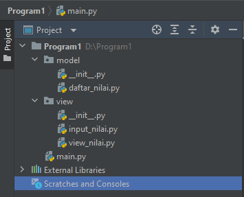

# UASsemester1

## SOAL UJIAN

## Struktur Package & Module

- Didalam folder / package model terdapat 1 file dengan nama daftar nilai. Dan didalam file tersebut telah terdapat beberapa function yang dibuat untuk menjalankan program tersebut. 
- Berikut adalah isi dari file **daftar_nilai.py**
